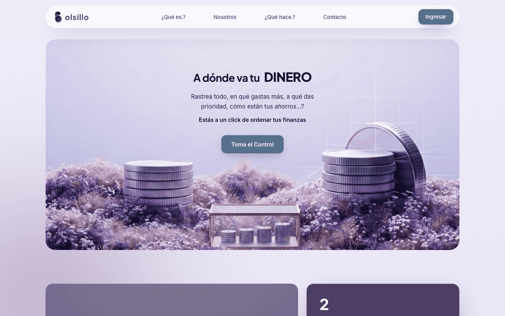
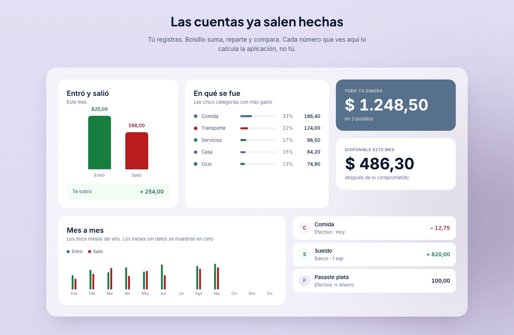
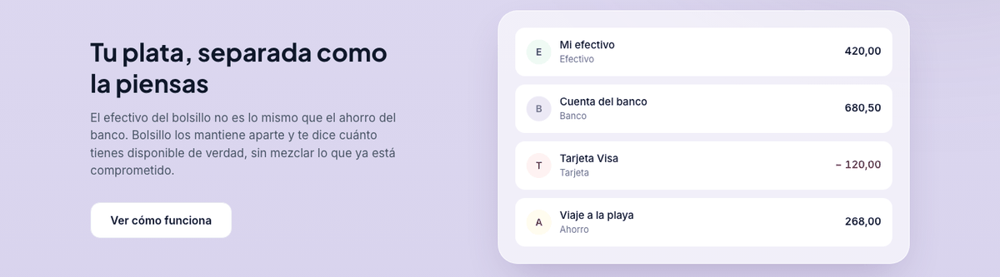
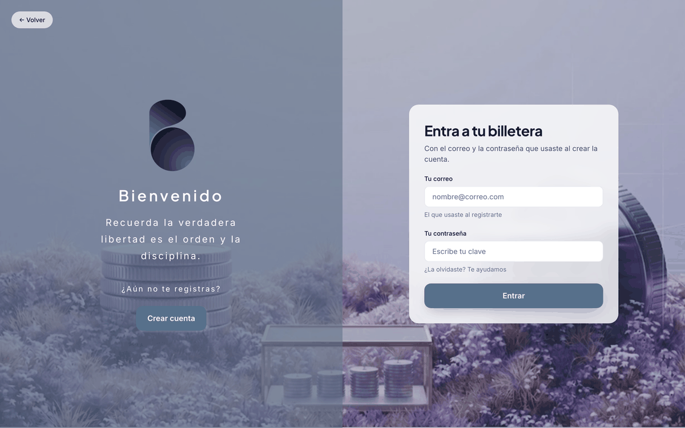
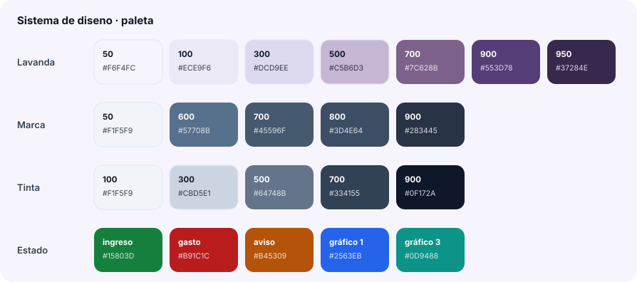
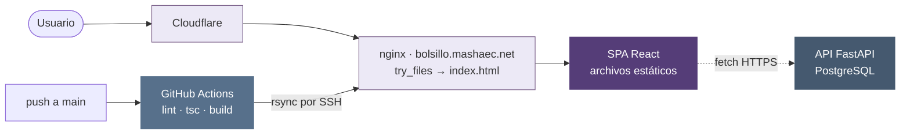

<div align="center">



<br>

**Lo que entra, lo que sale y lo que guardas, en un solo lugar.**

Frontend de Bolsillo: una aplicación de finanzas personales pensada para que registrar
un gasto tome dos toques y para que las cuentas ya salgan hechas.

<br>

[](https://bolsillo.mashaec.net)
&nbsp;
[](https://github.com/Alej1405/Bolsillo_tracker/actions/workflows/desplegar.yml)

<br>


</div>

---

## Qué es

Bolsillo separa tu plata como la piensas: el efectivo del bolsillo no es lo mismo que el
ahorro del banco. Registras un movimiento con su categoría y su bolsillo, y la aplicación
se encarga del resto — el reparto por categoría, el mes a mes y cuánto te queda disponible
de verdad.

Este repositorio es **solo el frontend**. Consume la API por HTTP y se despliega aparte:
el backend nunca sirve estos archivos.

| | |
|---|---|
| **En vivo** | [bolsillo.mashaec.net](https://bolsillo.mashaec.net) |
| **Backend** | FastAPI + PostgreSQL, en repositorio aparte |
| **Diseño** | Figma — *Proyecto RDA*, UI Kit y tokens en español |

---

## Cómo se ve

> Capturas de la interfaz real, tomadas del sitio en producción con Chrome en modo
> headless. Para regenerarlas: `npm run capturas`.

<div align="center">

| Portada | Reportes |
|:---:|:---:|
|  |  |
| Fotografía a sangre, navegación flotante en vidrio | Las cuentas salen hechas: reparto, mes a mes y saldos |

| Bolsillos | Acceso |
|:---:|:---:|
|  |  |
| Cada bolsillo aparte, con su saldo real | Panel que se desliza entre entrar y registrarse |

</div>

---

## Sistema de diseño

Los tokens salen del archivo de Figma. La escala lavanda se extrajo de la propia fotografía
del hero, así que la interfaz y la imagen comparten el mismo aire. **Todos los nombres van
en español**, igual que en el archivo de diseño.

<div align="center">

</div>

### Materiales

El **vidrio esmerilado** es lo que unifica la interfaz sobre la fotografía: relleno
translúcido, borde interior de 1 px, desenfoque de fondo y sombra **tintada en lavanda,
nunca negra** — una sombra negra sobre lavanda se ve sucia.

```css
.vidrio {
  background-color: color-mix(in srgb, #ffffff 62%, transparent);
  border: 1px solid color-mix(in srgb, #ffffff 72%, transparent);
  backdrop-filter: blur(32px);
  box-shadow: 0 24px 60px -20px color-mix(in srgb, var(--color-lavanda-900) 30%, transparent);
}
```

### Tipografía

| Rol | Fuente | Uso |
|---|---|---|
| `--font-titulo` | Plus Jakarta Sans | Titulares, cifras grandes, marca |
| `--font-cuerpo` | Inter | Texto corrido, etiquetas, formularios |

---

## Movimiento

Toda la animación vive en `src/movimiento/`. Ningún componente escribe una curva ni una
duración suelta: si algo se mueve, sus valores salen de `curvas.ts`.

```
src/movimiento/
├── curvas.ts          curvas, duraciones y umbrales de scroll  ← los valores
├── Revelar.tsx        revela un bloque al entrar en vista      ← el scroll
├── useAparicion.ts    aparición al montar (portada)
├── CifraAnimada.tsx   cifra que cuenta al entrar en vista
└── BarraAnimada.tsx   barras que crecen al entrar en vista
```

La curva por defecto es un **ease-out fuerte** — `cubic-bezier(0.23, 1, 0.32, 1)` — que
arranca rápido y frena largo. Es la misma en JavaScript y en CSS (`--ease-salida`).

Los umbrales de scroll no son arbitrarios: **cuanto más pequeño el elemento, más alto el
umbral**. Un bloque grande nunca llega a verse al 60 %, y una cifra que se anima al 30 %
termina de contar antes de que la leas.

| Umbral | Cuánto debe verse | Para qué |
|---|---|---|
| `vista.bloque` | 30 % | Secciones y tarjetas grandes |
| `vista.pieza` | 50 % | Barras y filas de un gráfico |
| `vista.cifra` | 60 % | Cifras que cuentan |

### Accesibilidad

Todos los componentes de movimiento respetan `prefers-reduced-motion`. Con la preferencia
activa el contenido se muestra estático y **ya visible**: la visibilidad nunca queda
condicionada a que una animación llegue a correr.

---

## Estructura

```
src/
├── movimiento/          capa de animación (arriba)
├── components/
│   ├── ui/              controles reutilizables — Boton
│   ├── piezas/          piezas del UI Kit portadas de Figma, una por archivo
│   ├── BarraNav.tsx     navegación flotante en vidrio
│   ├── Hero.tsx         portada
│   ├── Seccion*.tsx     un archivo por sección de la landing
│   └── PieDePagina.tsx
├── pages/
│   ├── Landing.tsx      compone las secciones sobre el fondo atmosférico
│   └── Auth.tsx         login y registro comparten pantalla y panel deslizante
├── index.css            tokens (@theme) y materiales (.vidrio, .panel-acceso)
└── main.tsx
```

Las **piezas** son reutilizables tal cual en el panel de control: la landing solo las
alimenta con datos de muestra. Se separan en estáticas (`FilaMovimiento`,
`TarjetaBolsillo` — listas que pueden tener muchas filas) y animadas (`CuantoTienes` y
los tres gráficos).

---

## Arquitectura



**El backend calcula, el frontend formatea.** La interfaz nunca suma ni promedia: recibe
el dato final y solo decide cómo mostrarlo. Por eso los porcentajes del reparto llegan
ya resueltos.

---

## Empezar

```bash
git clone git@github.com:Alej1405/Bolsillo_tracker.git
cd Bolsillo_tracker
npm install
npm run dev
```

| Comando | Qué hace |
|---|---|
| `npm run dev` | Servidor de desarrollo con recarga en caliente |
| `npm run build` | `tsc -b` y compilación de producción a `dist/` |
| `npm run preview` | Sirve el `dist/` compilado, para revisar antes de subir |
| `npm run lint` | Oxlint |

---

## Dónde tocar cada cosa

| Quiero… | Voy a… |
|---|---|
| Cambiar el ritmo de las animaciones | `src/movimiento/curvas.ts` — cambia toda la interfaz de golpe |
| Que un bloque aparezca al bajar | Envolverlo en `<Revelar>`; con `retraso` escalono hermanos |
| Que una cifra cuente o una barra crezca | `<CifraAnimada>`, `<BarraVertical>`, `<BarraHorizontal>` |
| Que algo entre al cargar, no al scroll | `useAparicion()`, como hace la portada |
| Cambiar colores, tipografías o radios | El bloque `@theme` de `src/index.css` |
| Añadir una sección a la landing | Un `Seccion*.tsx` nuevo, montado en `pages/Landing.tsx` |
| Suavizar el scroll de los anclas | `scroll-behavior` en `src/index.css` |

---

## Despliegue

Cada push a `main` dispara [`.github/workflows/desplegar.yml`](.github/workflows/desplegar.yml):
valida, compila y publica en el VPS por SSH. No hay que compilar ni subir nada a mano.

```
push a main → oxlint → tsc -b → vite build → rsync a /var/www/bolsillo.mashaec.net
```

El servidor solo recibe el `dist/` ya compilado; no hay Node ni `npm install` en producción.
Detalles de la configuración y de los secretos en [`docs/DESPLIEGUE.md`](docs/DESPLIEGUE.md).

---

## Convenciones

- **Todo en español**: nombres de componentes, props, variantes, tokens y capas. Es la
  convención del archivo de Figma y del equipo, y se respeta en el código.
- **CRUD completo por módulo**: ningún módulo se cierra sin sus cuatro operaciones.
- **El backend manda**: si el documento de UX contradice a la API, se ajusta el documento.
- **El frontend no calcula**: recibe el dato final y lo formatea.

---

## Equipo

Proyecto académico de la **Pontificia Universidad Católica del Ecuador**.
Diseño y frontend: [@Alej1405](https://github.com/Alej1405).

<div align="center">
<br>
<sub>Hecho en Ecuador 🇪🇨</sub>
</div>
